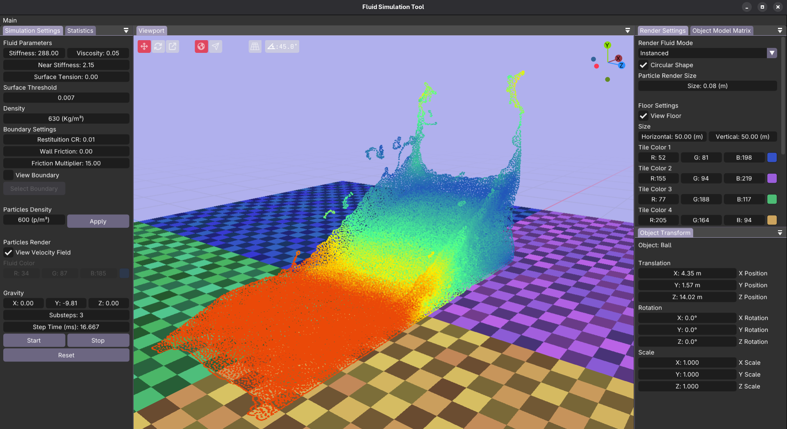
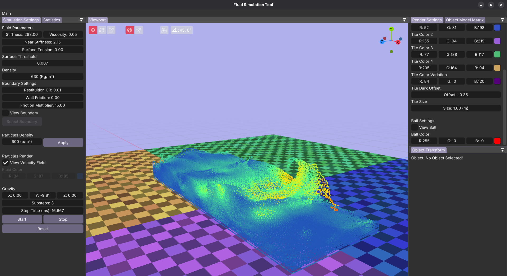
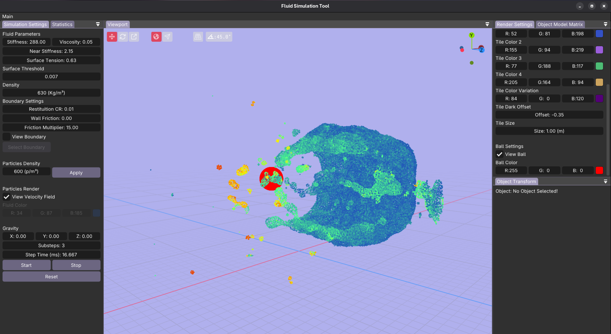
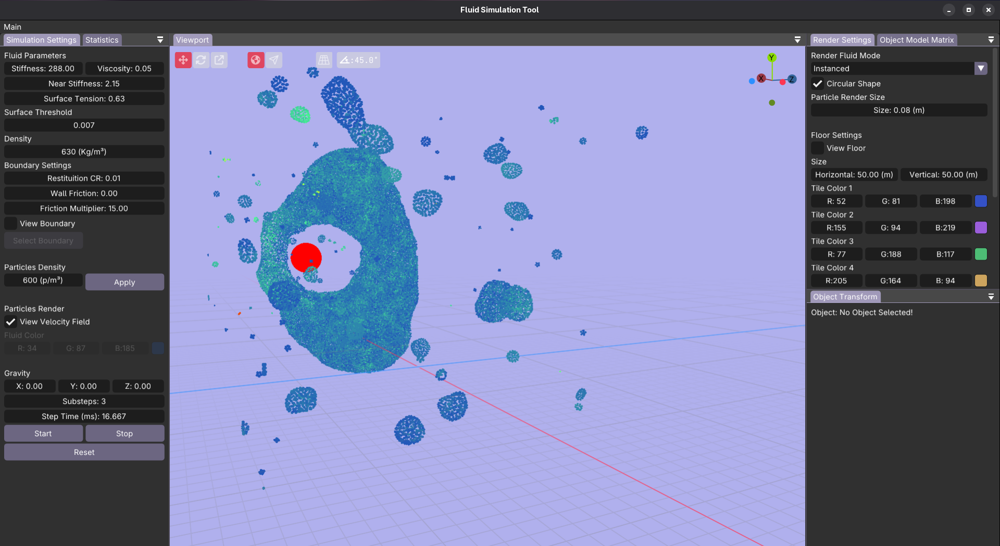

# SPH-Fluid-Simulation-Engine
This is a simple SPH fluid simulation engine built for demonstration purposes. It is entirely built with C++, using OpenGL for rendering and relying on OpenMP to perform SPH computations. The SPH algorithm will soon be ported to compute shaders so the computations can be performed on the GPU. Moreover, this project used [Fluid-Sim](https://github.com/SebLague/Fluid-Sim.git) as a reference to build the algorithm and other object shaders.

<br>

<p align="center">
<table>
  <tr>
    <td></td>
    <td></td>
  </tr>
  <tr>
    <td></td>
    <td></td>
  </tr>
</table>

</p>

<p align="center">
<br>
<em><b>Top:</b> Fluid moving and colliding with the domain. <b>Bottom:</b> Fluid collision tests performed with objects.</em>

</p>

## How to use the engine
### Installation

1. Clone the repository.
```
git clone -c http.sslverify=false -b calib-v2 https://github.com/acfr/cam_lidar_calibration
```

2. Compile the code.
```bash
cd SPH-Fluid-Simulation-Engine
mkdir build
cd build
cmake ..
make -j $(nproc)
```
3. Run the engine.
```bash
./fluidsim
```  
 
### References

Simulation:
<br>
* [Particle-Based Fluid Simulation for Interactive Applications](https://matthias-research.github.io/pages/publications/sca03.pdf)<br>
* [Particle-based Viscoelastic Fluid Simulation](https://web.archive.org/web/20250106201614/http://www.ligum.umontreal.ca/Clavet-2005-PVFS/pvfs.pdf)<br>
* [Smoothed Particle Hydrodynamics](https://sph-tutorial.physics-simulation.org/pdf/SPH_Tutorial.pdf)<br>
* [Position Based Fluids](https://mmacklin.com/pbf_sig_preprint.pdf)<br>
* [Unified Spray, Foam and Bubbles for Particle-Based Fluids](https://cg.informatik.uni-freiburg.de/publications/2012_CGI_sprayFoamBubbles.pdf)<br>
* [CS418-Smoothed Particle Hydrodynamics](https://courses.grainger.illinois.edu/cs418/fa2022/text/sph.html)<br>
* [GPU Fluid Simulation](https://web.archive.org/web/20250614144545/https://wickedengine.net/2018/05/scalabe-gpu-fluid-simulation/)<br>
* [Spatial Hashing](https://web.archive.org/web/20251019221148/https://developer.download.nvidia.com/presentations/2008/GDC/GDC08_ParticleFluids.pdf)<br>
* [SPH Fluids in Computer Graphics](https://cg.informatik.uni-freiburg.de/publications/2014_EG_SPH_STAR.pdf)<br>
* [Real-time SPH Fluid Simulation on GPU](https://aminaliari.github.io/fluid-simulation-webpage/)<br>
* [Particle Simulation using CUDA](https://web.archive.org/web/20140725014123/https://docs.nvidia.com/cuda/samples/5_Simulations/particles/doc/particles.pdf)<br>

Bitonic Sorter:
<br>
* [Implementing Bitonic Merge Sort in Vulkan Compute](https://poniesandlight.co.uk/reflect/bitonic_merge_sort/)<br>
* [Bitonic sorter](https://en.wikipedia.org/wiki/Bitonic_sorter)<br>

Rendering:
<br>
* [Screen Space Fluid Rendering with Curvature Flow](https://dl.acm.org/doi/epdf/10.1145/1507149.1507164)<br>
* [Reconstructing Surfaces of Particle-Based Fluids Using Anisotropic Kernels](https://faculty.cc.gatech.edu/~turk/my_papers/sph_surfaces.pdf)<br>
* [Screen Space Fluid Rendering for Games](https://developer.download.nvidia.com/presentations/2010/gdc/Direct3D_Effects.pdf)<br>

Main Reference:
<br>
* [Fluid-Sim](https://github.com/SebLague/Fluid-Sim/blob/main/README.md)<br>


